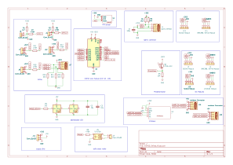
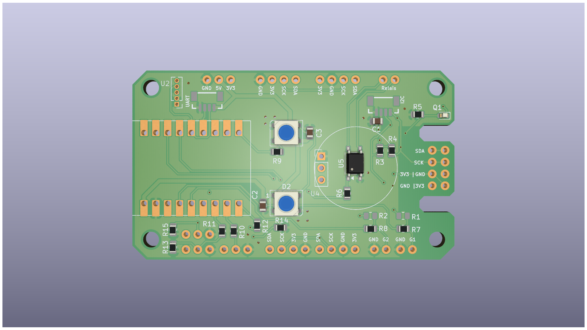

# MacropadMK

This project is a compact ESPhome compatible multisensor shield. The PCB is designed so that all required components can be hand-soldered—no SMD reflow oven or pick-and-place machine is required.
We want to eather use SMD componets that can be solderd by hand with a soldering iron or we want to use modules where the SMD sensors are presolderd. This makes it cheap but easy customizable.

The shield is modular and prepared for multiple purposes. The primary use case is as an ESPHome sensor with multiple sensor values available.

## Features

- Detecting human presence with LD2410B mmWave sensor
- Detecting motion with PIR sensor SR602
- Measuring brightness with PT19-21C
- 2x Onboard WS2812B LEDs for addressable color light
- SolidState Relais TLP175A for potential free contact
- Solder connections for several sensor modules like
  - BME280 -> temperature, humidity and air pressure
  - SCD40 -> CO₂, temperature and humidity
  - SHT40 -> temperature and humidity
  - and many others
- QWIIC connector for connecting additional QWIIC-compatible modules if needed

The idea is to have one general-purpose PCB and only populate the components necessary for your use case.

For example, if you want to use a SCD40 sensor to measure the CO2 level in a room, you don't a SHT40 sensor since the SCD40 already provides temperature and humidity data.

## Images





## KiBOT Export

This project uses KiBOT to automatically generate fabrication files and assets from the KiCAD project.

### Installation

KiBOT is containerized using Docker for easy installation and reproducibility. Make sure you have Docker installed on your system.

### Usage

#### Production Files (Gerber Data)

To generate the fabrication files including Gerber data, drill files, and bill of materials:

```bash
docker run --rm \
    -v "$(pwd):/home/kicad/project" \
    -u $(id -u):$(id -g) \
    -w /home/kicad/project \
    --env "HOME=/tmp" \
    ghcr.io/inti-cmnb/kicad10_auto_full:latest \
    CONFIG_FILE=project.config.yaml ./scripts/fabrication.sh
```

This command uses the `config.kibot.yaml` configuration file to generate production-ready files for PCB manufacturing, including Gerber files, drill data, and component placement information.

#### Assets (Images for Documentation)

To generate the images used in this README (schematics, 3D board views, etc.):

```bash
docker run --rm \
    -v "$(pwd):/home/kicad/project" \
    -u $(id -u):$(id -g) \
    -w /home/kicad/project \
    --env "HOME=/tmp" \
    ghcr.io/inti-cmnb/kicad10_auto_full:latest \
    ./scripts/assets.sh --config project.config.yaml
```

This command uses the `kibot_assets.kibot.yaml` configuration file to generate documentation images and assets.

### Configuration Files

- **scripts/kibot/config.kibot.yaml** - Shared fabrication configuration from the scripts submodule
- **scripts/kibot/kibot_assets.kibot.yaml** - Shared assets configuration from the scripts submodule

### Workflow

#### Assets Generation (Pre-Commit Hook)

The asset generation should be performed before each commit to ensure that documentation images in the README are always up-to-date with the latest design changes. This is best implemented as a pre-commit hook:

1. The pre-commit hook automatically runs the asset generation command before each commit
2. If the KiCAD project has been modified, new images are generated
3. These updated assets are included in the commit

This ensures that the schematic and board images in the documentation always reflect the current PCB design.

#### Production Files (CI/CD Pipeline)

Production manufacturing files are generated automatically through a GitHub Actions pipeline whenever changes are pushed to the repository:

- The pipeline runs `CONFIG_FILE=project.config.yaml ./scripts/fabrication.sh`
- Gerber files, drill data, and other manufacturing files are generated
- These files are available as build artifacts for download from the Actions tab

This automated approach ensures that fabrication files are always available and generated consistently.

Notes:
- Gerber files available from the Actions. [](https://github.com/ThomasLindenberger37/MacropadMK/actions/workflows/fabrication.yml)
