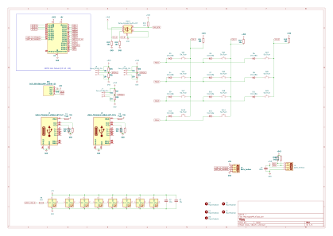
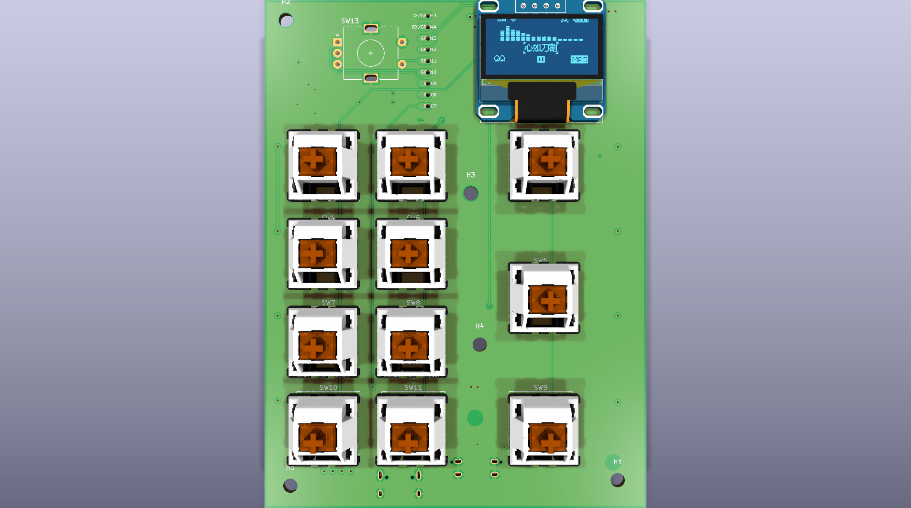

# MacropadMK

MacropadMK is a 12-key macropad built around the Waveshare ESP32-S3-Zero. The
board combines a diode-isolated 4 × 3 keyboard matrix, three USB-C power-entry
options, and two general-purpose JST-SH connections in a compact design.

The PCB is intended for an accessible prototyping workflow: order bare boards,
assemble and validate the first units by hand, then reuse the same LCSC-aware
bill of materials for a later JLCPCB assembly run.

## Design overview

- Controller: ESP32-S3-Zero
- Keyboard: 12 switches arranged as 4 rows × 3 columns
- Isolation: one diode per switch
- Matrix direction: `COL2ROW`
- Supply rails: `BOARD_5V`, `3V3`, and `GND`
- USB-C inputs: the controller connector plus two alternative PCB connectors
- Expansion: two identically pinned 3-position JST-SH connectors

## Keyboard matrix

The switches form a 4-row by 3-column matrix. `ROW1` through `ROW4` are scanned
one at a time by driving the selected row low. `COL1` through `COL3` are inputs,
each held high by an external 10 kΩ pull-up resistor to `3V3`.

Each key is an independent branch:

```text
COLx -> switch -> diode anode -> diode cathode -> ROWx
```

The diode orientation is `COL2ROW`: the cathode, identified by the stripe on the
physical diode, points toward the row line. When a selected row is low and a key
on that row is pressed, its column input is pulled low through the switch and
diode.

| Signal group | Quantity | Scan role | External bias |
| --- | ---: | --- | --- |
| `ROW1`–`ROW4` | 4 | Driven low individually | None |
| `COL1`–`COL3` | 3 | Digital inputs | 10 kΩ to `3V3` per column |

## USB-C power architecture

The ESP32-S3-Zero already has its own USB-C connector. The PCB provides two
additional connector positions as alternative 5 V inputs:

- Horizontal/right-angle: HRO `TYPE-C-31-M-12`
- Vertical/axial: `MC-110LD-L124`, USB 2.0, 16 pins, with THT mounting tabs
- Vertical connector LCSC/JLCPCB part number: `C3039282`

The additional connectors are currently used only for power. They are still
full USB 2.0 connector parts so that the same components and footprints can be
reused in future designs with USB data support.

Each additional receptacle follows these connection rules:

- Tie all VBUS pins of that receptacle together.
- Connect all GND pins to board ground.
- Connect `CC1` to GND through its own 5.1 kΩ resistor.
- Connect `CC2` separately to GND through its own 5.1 kΩ resistor.
- Connect the connector shield to GND.
- Leave `D+`, `D-`, `SBU1`, and `SBU2` unconnected and mark them as no-connect.

Each alternative receptacle feeds the common `BOARD_5V` rail through a separate
solder bridge. `BOARD_5V` connects to the ESP32-S3-Zero 5 V pin. An optional
resettable fuse rated for approximately 1 A can be fitted ahead of the shared
rail.

Place 10 µF bulk capacitance and 100 nF decoupling close to the 5 V input. Route
VBUS with approximately 0.8–1.0 mm wide traces; 0.25 mm traces are not
recommended for a 1 A supply path.

> **Power-source warning:** The board does not provide input OR-ing or reverse-
> current isolation. Only one USB power source may be connected at a time unless
> suitable input decoupling and source isolation are added.

## Additional connectors

The board provides two identically pinned 3-position JST-SH connectors with a
1.0 mm pitch.

- KiCad symbol: `Connector_Generic:Conn_01x03`
- KiCad footprint:
  `Connector_JST:JST_SH_SM03B-SRSS-TB_1x03-1MP_P1.00mm_Horizontal`

| Pin | Signal |
| ---: | --- |
| 1 | `GND` |
| 2 | `3V3` |
| 3 | Signal |

## Sourcing and assembly strategy

Components should use LCSC `C` part numbers wherever practical. The same part
numbers can be used both for loose component orders from LCSC and for JLCPCB
assembly BOM matching.

The intended manufacturing sequence is:

1. Order unassembled prototype PCBs.
2. Hand-assemble and electrically validate the first boards.
3. Resolve ERC/DRC findings and confirm footprints, polarity, and connector
   mechanics.
4. Reuse the validated BOM for a later JLCPCB assembly order.

## Project assets

[Download the schematic as PDF](assets/MacropadMK-schematic.pdf).





Some connector or encoder models may be absent from the rendered 3D preview if
their STEP files are not available locally. This does not affect the Gerber or
drill exports, but mechanical fit must still be checked before ordering.

## Fabrication and documentation exports

The repository contains its KiBot automation directly under `scripts/`. Docker
is required; the scripts use the KiCad 10 KiBot image configured in
`scripts/project.config.yaml`.

Generate the schematic PDF/SVG and the 3D preview:

```bash
./scripts/assets.sh
```

Generate Gerbers, drill files, BOM, placement data, the manufacturer ZIP, and
STEP models:

```bash
./scripts/fabrication.sh
```

Generated manufacturing files are written to `Fabrication/`. The validated
manufacturer archive is `Fabrication/MacropadMK-Gerber_Pack.zip`.

The relevant configuration files are:

- `scripts/project.config.yaml` — project name, KiCad image, PCB thickness, and
  mechanical-hole settings
- `scripts/kibot/config.kibot.yaml` — manufacturing outputs and production
  layers
- `scripts/kibot/kibot_assets.kibot.yaml` — documentation PDF, SVG, and 3D
  render outputs

Always run KiCad ERC and DRC and review the generated Gerbers before submitting
an order. Successful file generation does not imply that the electrical or
mechanical design is production-ready.

## Automated fabrication build

The GitHub Actions fabrication workflow generates manufacturing artifacts when
changes are pushed to the repository:

[](https://github.com/ThomasLindenberger37/MacropadMK/actions/workflows/fabrication.yml)
